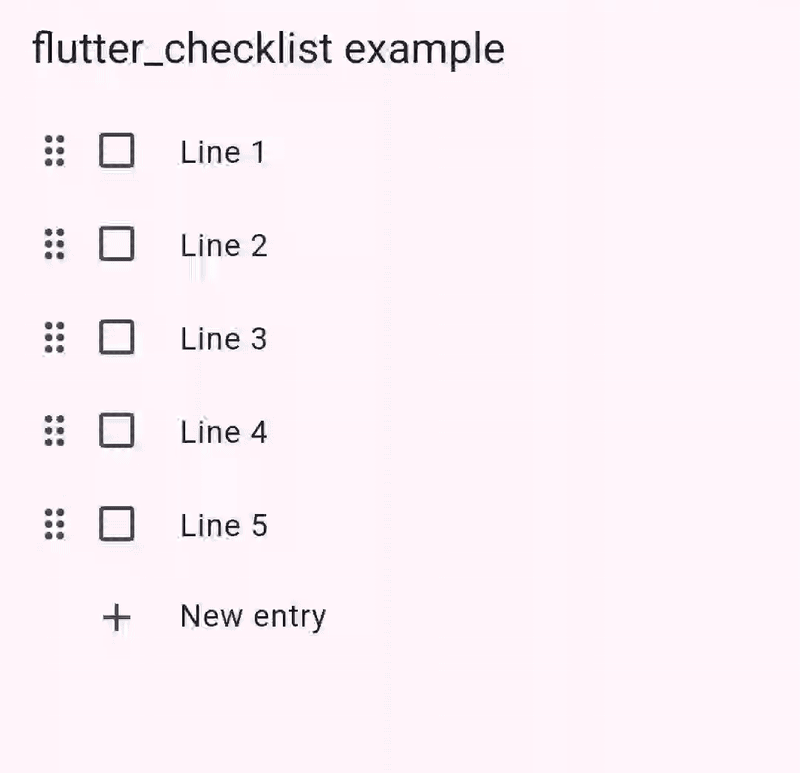

# flutter_checklist


A widget to display a checklist.



## Installing

See the [installing instructions](https://pub.dev/packages/flutter_checklist/install).

## Features

- Display a checklist
- Toggle items and edit their text
- Reorder items
- Add new items (either after the submitted one or at the end)
- Remove items
- Make the checklist read only

## Usage

### ChecklistLine

The `ChecklistLine` type is a [record](https://dart.dev/language/records) that represents a line (an item, an entry) of the checklist. It contains the text of that line and whether it is toggled.

A list of `ChecklistLine` represents a checklist with all its lines. The order of the list directly determines the order of the items in the checklist.

### Checklist

The `Checklist` widget displays your list of `ChecklistLine` as a checklist.

It requires as arguments the list of `ChecklistLine` to display, and a callback function to execute when any modification is performed on that list with the new list of `ChecklistLine`.

A checklist can be made read only by setting the `enabled` parameter to `false`, which disables any modification to the checklist lines as well as there reordering.

```dart
// The list of five ChecklistLine to display with their text and whether they are toggled
final lines = List.generate(
  5,
  (index) => (text: 'Line ${index + 1}', toggled: false),
);

// The function to execute when the checklist is modified, with the new list of ChecklistLine
void onChanged(List<ChecklistLine> lines) {
  log(lines.toString());
}

// The checklist widget
Checklist(
  lines: checklistLines,
  onChanged: onChanged,
);
```

### Localization

This package supports localization. To enable it in your app, add the localizations delegates to your `MaterialApp`:

```dart
MaterialApp(
  localizationsDelegates: [
    ...ChecklistLocalizations.localizationsDelegates,
    // Any other localizations delegates, from your app or other packages
  ],
);
```

The following localizations are currently supported (ordered alphabetically):

- English
- French

To add support for a new localization or improve an existing one, please open an [issue](https://github.com/maelchiotti/flutter_checklist/issues).

## Example

See the [example app](https://pub.dev/packages/flutter_checklist/example).
